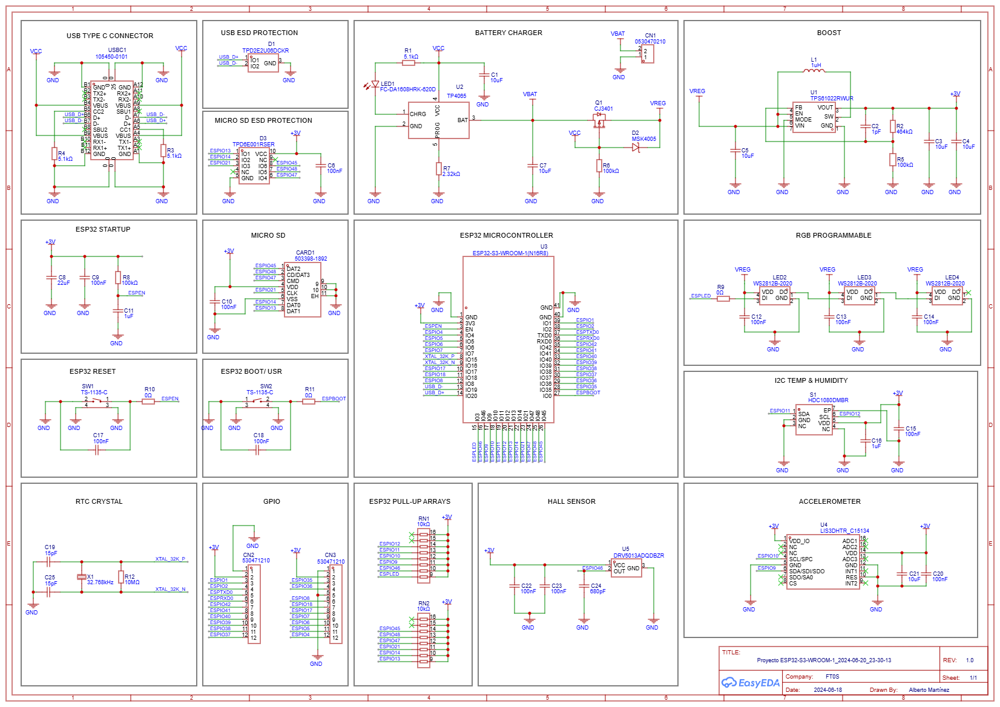
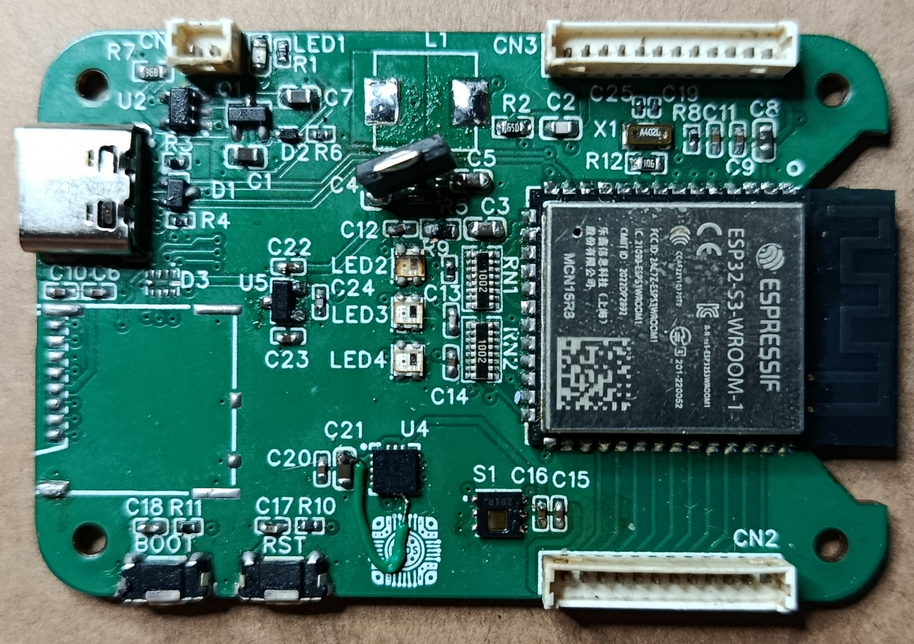
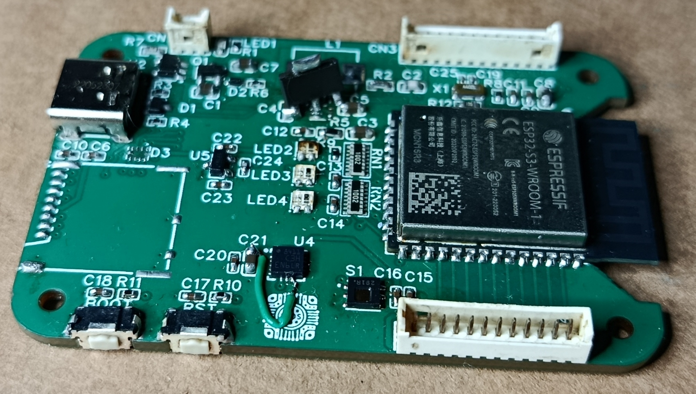

# ESP32-S3 Portable Sensor Node

Custom ESP32-S3 embedded platform designed, manufactured, assembled and validated from scratch.

This project documents the complete hardware development cycle, including requirements definition, schematic capture, PCB layout, manufacturing, assembly, firmware bring-up, hardware debugging, failure analysis and redesign planning.

The objective was to develop a compact portable sensor platform based on the ESP32-S3, integrating environmental sensing, motion sensing, local storage, battery operation and wireless connectivity.

---

## Project Status

⚠️ **Revision A completed**

Hardware validation successfully confirmed operation of the main platform features. During bring-up, a power architecture issue was identified that requires a redesign of part of the system.

A Revision B is currently planned based on the lessons learned during validation.

---

## Features

### Processing & Connectivity

* ESP32-S3-WROOM-1
* WiFi
* Bluetooth Low Energy (BLE)
* USB-C interface

### Power System

* Li-Ion battery support
* Battery charging circuitry
* On-board voltage regulation

### Sensors

* HDC1080 temperature and humidity sensor
* LIS3DH accelerometer
* DRV5013 Hall-effect sensor

### Storage

* MicroSD card interface

### User Interface

* WS2812 RGB LEDs

---

## Engineering Work Performed

### Hardware Design

* Requirements definition
* Component selection
* Schematic capture
* Design review
* Power architecture design
* Sensor integration
* Battery subsystem integration
* USB-C integration

### PCB Design

* PCB floorplanning
* Routing
* Design rule verification
* Manufacturing file generation

### Manufacturing & Assembly

* PCB fabrication
* Component sourcing
* Hand assembly
* Inspection and rework

### Firmware Development

* Hardware bring-up
* Peripheral validation
* Sensor testing
* Wireless connectivity testing
* Web-based diagnostics interface

### Validation & Debugging

* Power rail verification
* I²C bus validation
* Sensor characterization
* Failure analysis
* Root cause investigation
* Revision planning

---

## Validation Status

| Feature              | Status                 |
| -------------------- | ---------------------- |
| ESP32-S3 Boot        | ✅                      |
| USB-C Power          | ✅                      |
| Battery Charging     | ✅                      |
| WiFi                 | ✅                      |
| BLE                  | ✅                      |
| WS2812 RGB LEDs      | ✅                      |
| HDC1080              | ✅                      |
| MicroSD Interface    | ⏳                      |
| DRV5013 Hall Sensor  | ⏳                      |
| LIS3DH Accelerometer | ⚠️ Under Investigation |

---

## Schematic

---

## Manufactured PCB

---

## Assembly

---

## Power and LIS3DHTR CS fix

---

## Bring-Up

Initial firmware was developed to validate the hardware platform.

Validated functions:

* WiFi network scanning
* WiFi connection
* BLE scanning
* HDC1080 sensor communication
* WS2812 RGB LED control
* Embedded web server

The platform currently exposes a web-based diagnostic interface displaying:

* Temperature
* Humidity
* WiFi RSSI
* System uptime
* Sensor logging
* CSV export
* RGB LED control

---

## Failure Analysis

During validation a power architecture issue was identified.

The issue does not prevent basic platform operation but affects the overall robustness of the design and must be corrected before production or extended deployment.

Revision B will incorporate:

* Power architecture improvements
* Validation findings from Revision A
* Design-for-debug enhancements
* General reliability improvements

This project intentionally documents both successful and unsuccessful design decisions as part of the engineering process.

---

## Lessons Learned

Key topics explored during the project:

* ESP32-S3 hardware integration
* Mixed-signal PCB design
* Battery-powered embedded systems
* Sensor integration and debugging
* I²C validation techniques
* Wireless connectivity testing
* Hardware bring-up methodology
* Root cause analysis
* Engineering iteration and redesign

---

## Documentation

Complete engineering documentation is available in the `docs/` directory.

* Requirements
* Architecture
* Schematic Design
* PCB Design
* Bring-Up
* Validation
* Debugging
* Failure Analysis
* Revision B Proposal
* Lessons Learned

---

## Future Work

* Complete LIS3DH validation
* Complete DRV5013 validation
* Validate MicroSD subsystem
* Implement battery monitoring
* Improve enclosure integration
* Develop Revision B hardware
* Extended environmental testing
* Long-term battery testing
