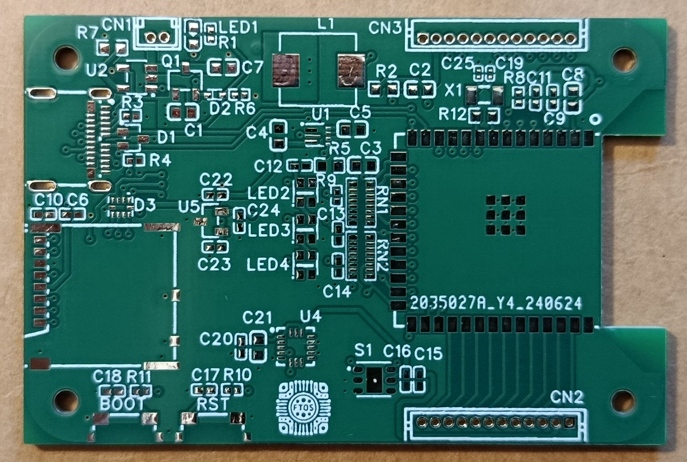
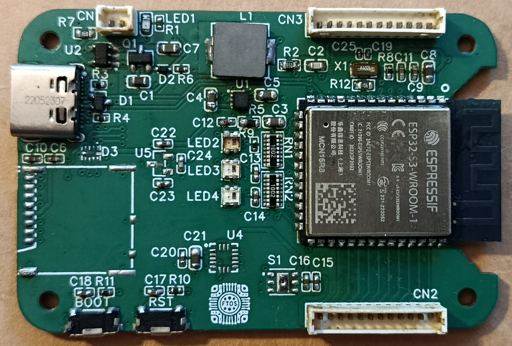

# ESP32-S3 Portable Sensor Node

Custom ESP32-S3 sensor platform designed from scratch, including schematic capture, PCB layout, manufacturing, hand assembly, bring-up and hardware debugging.

## Status

⚠️ Rev A completed. A power architecture issue was identified during validation. Rev B redesign planned.

---

## PCB Layout

---

## Manufactured PCB

---

## Assembly

---

## Features

- ESP32-S3-WROOM-1
- USB-C charging
- Li-Ion battery support
- MicroSD storage
- HDC1080 temperature/humidity sensor
- LIS3DH accelerometer
- DRV5013 Hall sensor
- WS2812 RGB LEDs

---

## Documentation

Complete engineering documentation available in the `docs/` directory.

- Requirements
- Architecture
- Schematic review
- PCB layout
- Bring-up
- Debugging
- Failure analysis
- Rev B proposal
- Lessons learned
